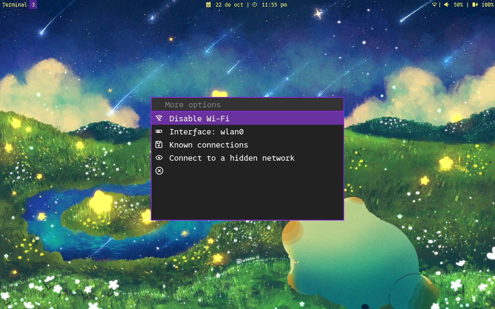

# wifimenu

A Bash script to connect to a Wi-Fi network using NetworkManager and a launcher.




Launcher style in the screenshots above is not include.

## Features

- Enable/Disable Wi-Fi device
- Select the Wi-Fi interface to use
- Connect to a hidden Wi-Fi network
- Forget known connections
- Disconnect from the current connected Wi-Fi network
- Shows if Wi-Fi network is secure via WPA 1/2
- Shows signal level visually
- A submenu to contain all of the above options
- Translate to your language by modifying script variables
- Can be use with your preferred launcher:
	- wofi
	- rofi
	- wmenu
	- dmenu
	- bemenu

## Considerations

- Does not show WEP Wi-Fi networks, and probably never will
- Does not notify about the result of the connection operation, and maybe I will add the option in the future
- When using this script with dmenu launcher, the botton for hide passwords does not work

## Dependencies

- Bash (but I'm not sure, or am I?)
- NetworkManager
- At least one of the following launchers: wofi, rofi, wmenu, dmenu, bemenu
- It uses heavily Nerd Fonts characters. [Download a font](https://www.nerdfonts.com/) or change the characters at your own risk

## Translation and customization

The following files are sourced in the corresponding order. If one of the files is found, the following files will not be searched:

1. $XDG\_CONFIG\_HOME/$program\_name/config
2. $HOME/.config/$program\_name/config
3. $HOME/.$program\_name

The variable `program_name` is set to `basename $0`.

Any modification of the program can be made in the configuration file to avoid losing modifications when updating the script.
Command line options overwrite this file.

Some variables of interest may be:

- **launcher**: A string defining the launcher.
- **submenu**: If set, shows Wi-Fi options in a submenu.

The following variables can be changed in the the configuration file to translate the text:

```bash
tr_scanning_networks="Scanning networks"
tr_scanning_networks_complete="Scanning completed"
tr_submenu_message="More options"
tr_disable_message="Disable Wi-Fi"
tr_enable_message="Enable Wi-Fi"
tr_known_connections_message="Known connections"
tr_hidden_message="Connect to a hidden network"
tr_autoconnect_message="Autoconnect"
tr_ipv4_config_message="DHCP configuration"
tr_dns4_message="DNS IPv4"
tr_ipv6_config_message="IPv6 configuration"
tr_dns6_message="DNS IPv6"
tr_autoip_message="Automatic IP configuration"
tr_autodns_message="Automatic DNS"
tr_address_message="Addresses"
tr_gateway_message="Gateway:"
tr_forget_message="Forget connection"
tr_interface_message="Interface:"

tr_main_menu_prompt="Wi-Fi SSID:"
tr_select_interface_prompt="Interface to use:"
tr_connect_hidden_prompt="Network name:"
tr_ask_password_prompt="Password:"
tr_menu_dns_prompt="New DNS:"
tr_menu_dns_sure_prompt_1="Remove DNS"
tr_menu_dns_sure_prompt_2="?"
tr_menu_ip_config_addresses_prompt="address1/mask,address2/mask,..."
tr_menu_ip_config_gateway_prompt="New gateway:"
tr_menu_addresses_prompt="New address:"
tr_menu_addresses_sure_prompt_1="Remove address"
tr_menu_addresses_sure_prompt_2="?"
tr_forget_connection_prompt="Connection to forget:"
tr_forget_connection_sure_prompt_1="Forget"
tr_forget_connection_sure_prompt_2="?"
```

## License

wifimenu is free software: you can redistribute it and/or modify it under the terms of the GNU General Public License as published by the Free Software Foundation, either version 3 of the License, or (at your option) any later version.

wifimenu is distributed in the hope that it will be useful, but WITHOUT ANY WARRANTY; without even the implied warranty of MERCHANTABILITY or FITNESS FOR A PARTICULAR PURPOSE. See the GNU General Public License for more details.
 
You should have received a copy of the GNU General Public License along with this program. If not, see <https://www.gnu.org/licenses/>.
